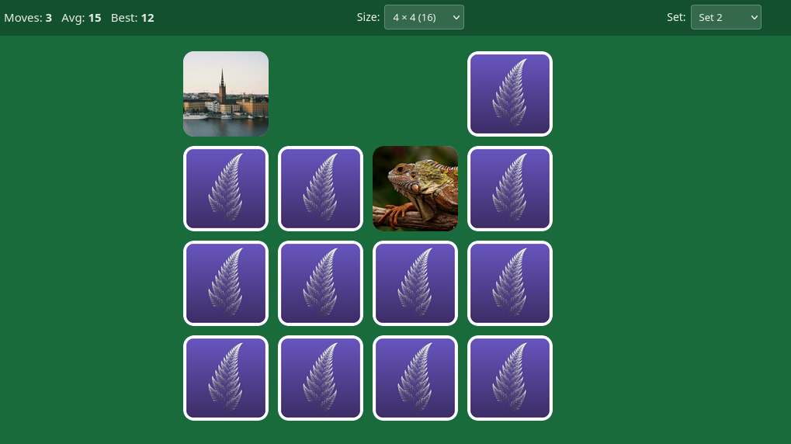

# Mempair - Memory Pair Web Game

This is a vibe coded implementation of the pair memory game. The main target is to play on a tablet. There are several sets of images, up to two, for the largest game. The game
uses local storage in your browser to keep current game and statistics.

I like [Memory](https://play.google.com/store/apps/details?id=com.ravensburger.memory&hl=en-US) game implementation, but not the menu system, nor that it is pretty slow in most aspects.

## Images

The back side is the classic leaf fractal, AI generated. The photos and images are from either https://pixabay.com/ or https://unsplash.com/ or https://www.pexels.com/
No persons can be identified on the images (perhaps cats can?) nor are there any images that are not suitable for children.

## License
All files that contains text and/or code except this README are LLM generated, so the usual gray-zone license soup. But for this small kind of toy project, I think MIT is suitable.
For the license of the images, see respective site's license rules.
